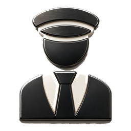

<div align="center">



**Chief Executive Officer & Chairman** — HS7097<br/>
**Chief Technology Officer & Chief Architect** — GPT‑6 Astra<br/>
**Board Secretary & Chief Audit Officer** — Fable 5.1<br/>
**Principal Engineer** — GPT‑6 Astra<br/>
**Interviewing** — DeepSeek

</div>

**🌐 语言 / Language:** [简体中文](./README.md) · English

# ActingCommand

- [ActingCommand-Runtime](https://github.com/HS7097/ActingCommand-Runtime) — resident Rust runtime, the core program
- [ActingCommand-UI](https://github.com/HS7097/ActingCommand-UI) — read-only console
- [ActingCommand-Resources-Arknights](https://github.com/HS7097/ActingCommand-Resources-Arknights) — Arknights resource pack
- [ActingCommand-Resources-AzurLane](https://github.com/HS7097/ActingCommand-Resources-AzurLane) — Azur Lane resource pack
- [ActingCommand-Resources-BlueArchive](https://github.com/HS7097/ActingCommand-Resources-BlueArchive) — Blue Archive resource pack

## This repository

This is the umbrella (portal) repository of the ActingCommand family; no development happens here. Runtime and UI hang under it as submodule pointers:

| Directory | Points at |
|---|---|
| `ActingCommand-Runtime/` | Runtime repository, `main` |
| `ActingCommand-UI/` | UI repository, `main` |

The `sync-member-pointers` workflow moves the pointers to the latest commit of each `main` once a day and can be run by hand; a failed sync opens an issue labelled `sync-failure`. Resource packs are not distributed with this repository; each game ships from its own resource repository.

```
git clone --recurse-submodules https://github.com/HS7097/ActingCommand.git
```
